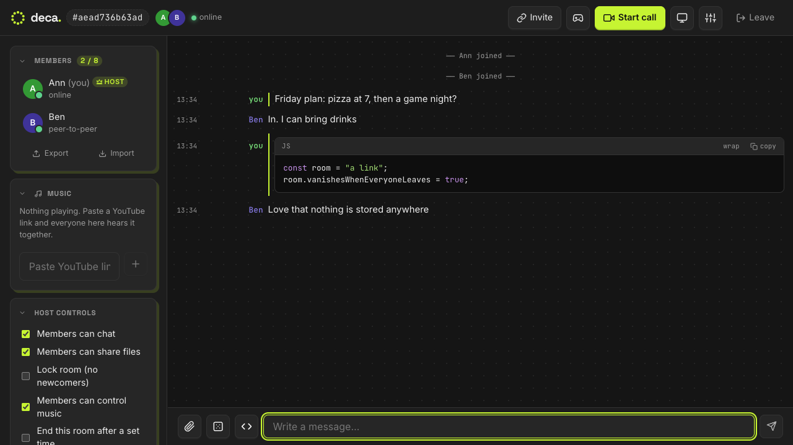
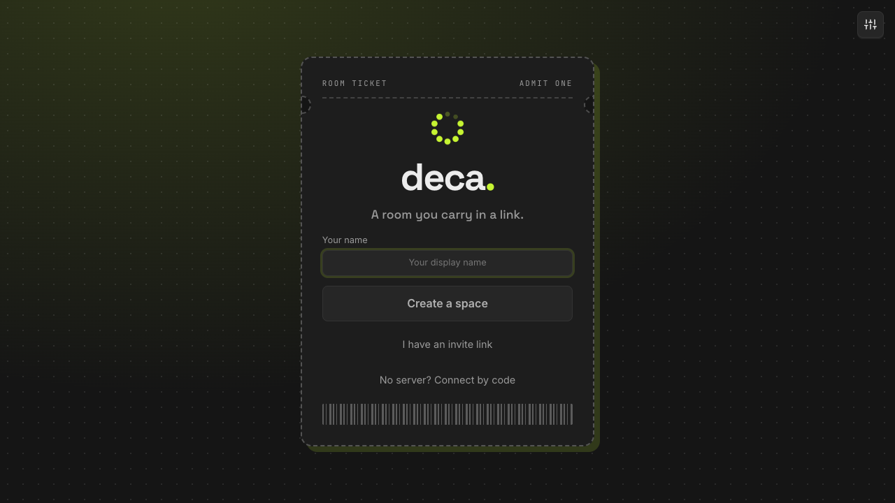
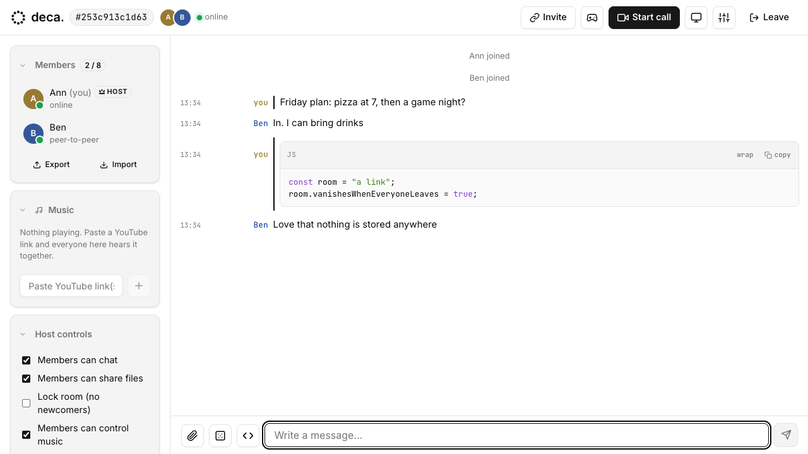

<div align="center">


# deca.

**A hangout room you carry in a link.**<br>
Chat, calls, files, music and games, directly between your browsers. No accounts, nothing stored.

[](LICENSE)
[](#built-entirely-by-ai)
[](docs/SPEC.md)
[](https://nodejs.org)

[**Live demo**](https://deca-oi1q.onrender.com) &nbsp;·&nbsp; [Quick start](#quick-start) &nbsp;·&nbsp; [No server mode](#no-server-connect-by-code) &nbsp;·&nbsp; [Docs](docs/SPEC.md) &nbsp;·&nbsp; [Contributing](CONTRIBUTING.md)

<br>



</div>

<br>

## Built entirely by AI

Every line of code, every test and all the documentation in this repository were written by **Claude** (Anthropic), working with a human who chose what to build, tried the results and gave feedback. Read the code and the [security notes](docs/SPEC.md#security) before relying on it for anything sensitive.

## What it is

Open Deca, create a space, send the link, and you are in a private room. It runs peer to peer in the browser (WebRTC). A tiny Node server only introduces people to each other: it never sees messages or files, and it stores nothing. When everyone leaves, the room is gone.

|  |  |
|---|---|
| **No accounts** | Your identity is a key pair made in your browser. Every event is signed, so nobody can speak as someone else. |
| **Private by default** | Chat, files and calls go straight between browsers. Rooms hold up to 8 people. |
| **Leaves no trace** | Nothing is stored on a server. Export a room to a signed zip only if you want to keep it. |
| **Easy to host** | One small Node process, or no server at all on a static host. Free plans are enough. |

## Features

| | |
|---|---|
| **Talk** | chat with code blocks and inline image previews, video, audio and screen share (with sound where the browser allows), files up to 50 MB |
| **Together** | music everyone hears in sync (YouTube links), games panel (Snake, Pixel Hop, Freedoom), coin flip, rock-paper-scissors, a random "blame someone" button |
| **Host tools** | mute chat or files, lock the room, wake everyone up, optional end time and end-of-room summary |
| **Yours** | themes (including a shadcn-style "Zinc" look), personal wallpaper that can tint the accent, export and import of a room as a signed zip |
| **Resilient** | automatic reconnect, host succession, ICE restart, and a no-server mode for when nothing else works |

Want to build a panel (a poll, a whiteboard, a game)? See the [plugin spec](docs/PLUGINS.md). [docs/SPEC.md](docs/SPEC.md) is the full design: concepts, sync model, protocol, security and limits.

<details>
<summary><b>More pictures</b></summary>
<br>

<br><br>

</details>

## Try it

- **Live demo:** <https://deca-oi1q.onrender.com>. It runs on a free plan that sleeps when idle, so the first visit can take up to a minute to wake. Create a space and send the link to a friend.
- **Host your own in a few clicks:**
  [](https://render.com/deploy?repo=https://github.com/S-Harshit/deca)
  (free plan, full version) &nbsp; [](https://vercel.com/new/clone?repository-url=https://github.com/S-Harshit/deca) (the no-server version).
- **Run it on your computer:** see below, or [START-HERE.md](START-HERE.md) if you are not technical.

## Quick start

**Not technical?** Read [START-HERE.md](START-HERE.md). It is one page: install Node.js once, unzip, double-click `Start Deca`, send the link it shows.

| | |
|---|---|
| **Easiest** | Download `deca-ready.zip` from the Releases page (already built), unzip it, and double-click **`Start Deca.command`** (Mac) or **`Start Deca.bat`** (Windows). You only need [Node.js](https://nodejs.org) 18 or newer; the start file opens its download page if it is missing. |
| **From source** | The same two files work in a plain download or clone of this repository. The first run installs and builds everything itself (a few minutes), with a calm progress line instead of build logs. |
| **Terminal** (Mac, Windows, Linux) | `node scripts/start.mjs` (public link for friends), `node scripts/start.mjs --local` (this computer only), `--port 9000`, `--no-open`. |

<details>
<summary><b>What the launcher does, and why a public link</b></summary>
<br>

It sets itself up on first run, starts Deca, downloads the free Cloudflare tunnel program if you do not have it (a plain public download from github.com: no GitHub account or login), prints the public link, copies it to your clipboard and opens it. Closing its window stops everything. If the public link cannot be made it says so and keeps working on this computer. A brand-new link can take up to a minute to resolve on some networks; reload if it says "not found". The link changes on every start.

Why not your local network address? Browsers only allow the camera and the signing keys Deca uses on `https://` or `localhost`, so a plain `http://192.168...` link will not work for other people. Use the tunnel, or put the server behind your own HTTPS. No computer to leave on? Host it instead (see [Hosting](#hosting)): the included `render.yaml` deploys it to Render's free plan in a few clicks, and the link is then permanent.
</details>

<details>
<summary><b>For developers</b></summary>
<br>

Needs **Node 18+**. The older helper script also needs **bash**, **curl** and **tar** (macOS or Linux; on Windows use WSL): `./deca.sh up` (public link), `./deca.sh up local` (this machine only), `./deca.sh down`.

```bash
# manual start, no script
cd dema-client && npm ci && npm run build
cd ../dema-server && npm ci && node server.js

# hot reload (self-signed HTTPS, which the camera needs; HTTP=1 for plain http)
cd dema-client && npm run dev

# checks that must be clean
cd dema-client && npx tsc -b && npx eslint src && npm run build
cd tests && npm ci && node run.mjs quick
```

Build the shareable package with `npm run package` (output `deca-ready.zip`); pushing a `v*` tag does it on GitHub (`.github/workflows/release.yml`) and attaches it to the release. Tests are described in [tests/README.md](tests/README.md).
</details>

## No server? Connect by code

On the first screen choose **No server? Connect by code**. People join by exchanging a short code each way (copy, paste, send it any way you like), and everyone else in the room is then connected automatically. Codes are signed, newcomers need the host's approval, and members can compare check words. It works when the usual way is down, and it is what makes a **fully static, free deployment** possible: `npm run build:static` makes `dist-static/`, a plain folder that works on GitHub Pages, Vercel, Netlify or any static host (`vercel.json` and a Pages workflow are included). It still uses public STUN servers (free) to find your address, and strict networks may still need a relay. Details and limits: [docs/SPEC.md](docs/SPEC.md#connect-by-code-no-signaling-server).

## Hosting

Any host that runs one Node process and supports WebSockets works. `render.yaml` is a ready blueprint for Render's free tier; Fly.io, Railway and Koyeb are similar, and a home machine behind a tunnel works too. The server is small (tens of MB of RAM idle) and media never passes through it. Strict networks may need a TURN relay: set `ICE_SERVERS` (below). See the hosting and TURN sections of [docs/SPEC.md](docs/SPEC.md#8-running-and-hosting).

<details>
<summary><b>Server configuration</b> (environment variables, all optional)</summary>
<br>

| Variable | Default | Meaning |
|---|---|---|
| `PORT` | 8080 | listen port |
| `MAX_PEERS` | 8 | people per room (0 = no cap) |
| `GRACE_MS` | 10000 | how long a dropped member can resume |
| `ICE_SERVERS` | Google STUN | JSON list of STUN/TURN servers; add a TURN service for strict networks |
| `ALLOWED_ORIGINS` | any | comma-separated origins allowed to open the WebSocket |
| `MAX_PAYLOAD` | 64 KB | largest signaling message |
| `MAX_SOCKETS` / `MAX_ROOMS` | 4000 / 1000 | global caps |
| `MAX_PER_IP` / `JOINS_PER_MIN` | 40 / 60 | per-address limits |
| `MSG_BURST` / `MSG_PER_SEC` | 250 / 100 | per-socket message rate |
| `JOIN_TIMEOUT_MS` | 5000 | a socket that does not join a room in time is closed |
</details>

## Games

The games panel plays any static web game found in `dema-server/games/<id>/` (needs an `index.html`; optional `game.json` with `title`, `controls`, and `heavy` for games that wait behind a Start button). Included: Snake, Pixel Hop (an original platformer), and [Freedoom](https://freedoom.github.io) (BSD-licensed; run `dema-server/games/freedoom/get-wad.sh` once to download its 28 MB data file; the engine loads from the EmulatorJS CDN, so it needs internet). Games can report scores to the room's hidden leaderboard (see the spec).

Games run on the app's origin, so only add games you trust. Do not commit games you do not have the rights to; everything under `games/` except the three above is git-ignored.

## Security and privacy

Signed events, per-identity server secrets, size, rate and connection limits, a Content Security Policy on the app, and no stored data. It is designed for small private rooms, not as a hardened public service. Details and known gaps are in the Security section of [docs/SPEC.md](docs/SPEC.md#security); report problems privately through [SECURITY.md](SECURITY.md).

No accounts, no analytics, nothing stored on the server. Chat, files and calls go between browsers (a relay, if you use one, carries only encrypted bytes). Your browser does request fonts from Google Fonts and, if you use music, YouTube's player. Image previews are on by default: fetching a picture from a link reveals your address to its host (turn them off in Appearance). More in [THIRD_PARTY_NOTICES.md](THIRD_PARTY_NOTICES.md).

## Status and contributing

Deca is an experiment that works, not a polished product. It is built for small private rooms (up to 8 people), has been tested mostly in Chromium, and has rough edges. Issues and pull requests are welcome: please read [CONTRIBUTING.md](CONTRIBUTING.md) first, and be kind ([CODE_OF_CONDUCT.md](CODE_OF_CONDUCT.md)). `CLAUDE.md` holds guidance for AI coding assistants and doubles as a developer cheat sheet.

<details>
<summary><b>Project layout</b></summary>
<br>

```
dema-client/               React + TypeScript + Vite web app
dema-server/               Node signaling server (ws) + static hosting, games/
docs/SPEC.md               design and protocol (the source of truth)
docs/PLUGINS.md            plugin specification (draft)
tests/                     unit and Playwright browser tests (see tests/README.md)
scripts/start.mjs          the launcher the double-click files run (Mac, Windows, Linux)
scripts/package.mjs        builds deca-ready.zip
scripts/build-static.mjs   builds dist-static/ for GitHub Pages / Vercel (no server)
scripts/deca.sh            developer script: build + run + public tunnel
Start Deca.command / .bat  double-click launchers (Mac / Windows)
START-HERE.md              the plain-words guide for non-technical people
render.yaml, vercel.json   one-click hosting recipes
CONTRIBUTING.md, SECURITY.md, CODE_OF_CONDUCT.md, THIRD_PARTY_NOTICES.md
.github/                   release, pages and test workflows, issue and PR templates
```
</details>

## License

[MIT](LICENSE). Third-party pieces keep their own licences: see [THIRD_PARTY_NOTICES.md](THIRD_PARTY_NOTICES.md).
